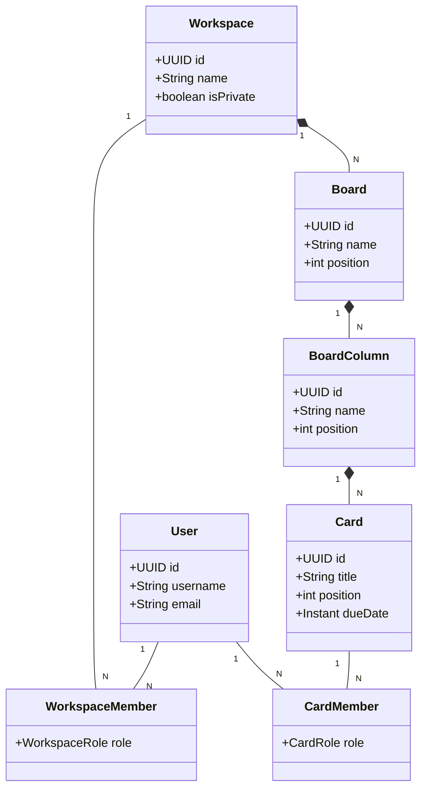
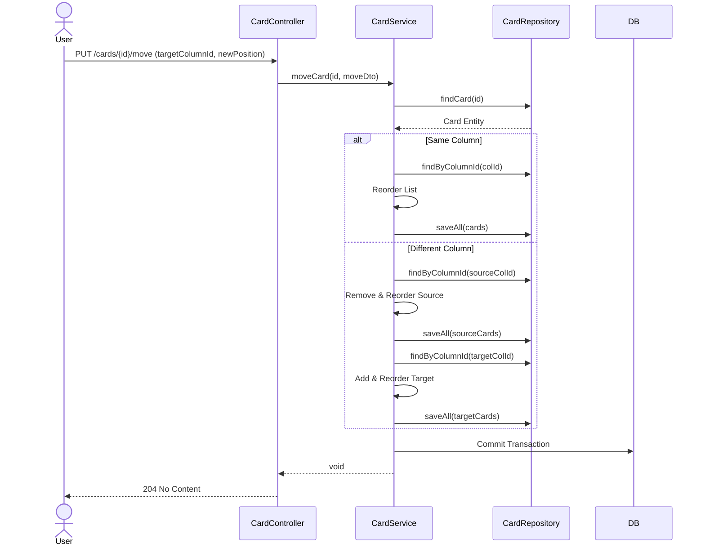

# TaskFlow Kanban - Architectural Conception

This document outlines the conceptual design, architecture, and data model of the TaskFlow Kanban backend.

## 1. Architecture Overview

The application follows a standard **Layered Architecture** based on the Spring Boot framework:

*   **Presentation Layer (Controllers)**: Handles HTTP requests, validation (DTOs), and maps responses. It is the entry point for the REST API.
*   **Service Layer**: Contains the business logic. It handles transactions, authorization checks, and orchestrates data operations.
*   **Data Access Layer (Repositories)**: Uses Spring Data JPA to interact with the PostgreSQL database.
*   **Security Layer**: A filter chain intercepts requests to validate JWT tokens and populate the security context.

## 2. Domain Model

The domain is structured hierarchically to support multi-tenancy and granular permissions.

### 2.1. Hierarchy
1.  **Workspace**: The top-level container. Represents an organization or a team.
    *   Contains multiple **Boards**.
    *   Has **Members** with global workspace roles (Owner, Admin, Member, Viewer).
2.  **Board**: A specific project or workflow.
    *   Belongs to a Workspace.
    *   Contains **Columns** (Lists).
    *   Can have specific **Board Members** (overriding or augmenting workspace access).
3.  **Column**: A stage in the workflow (e.g., "To Do", "In Progress").
    *   Belongs to a Board.
    *   Contains **Cards**.
4.  **Card**: An individual task or item.
    *   Belongs to a Column.
    *   Has rich metadata: Title, Description, Due Date, Priority, Labels.
    *   **Card Members**: Users assigned to the card with specific roles (Lead, Assignee, Reviewer, Viewer).

### 2.2. Entity Relationships (ERD Concept)

*   **User** `1:N` **WorkspaceMember** `N:1` **Workspace**
*   **Workspace** `1:N` **Board**
*   **Board** `1:N` **BoardColumn**
*   **BoardColumn** `1:N` **Card**
*   **Card** `1:N` **CardMember** `N:1` **User**
*   **Card** `1:N` **ActivityLog** (Polymorphic association)

### 2.3. Class Diagram (Mermaid)

## 3. Security & Permissions

### 3.1. Authentication
*   **Stateless JWT**: The server issues a short-lived Access Token and a long-lived Refresh Token upon login.
*   **CustomUserDetails**: Extends Spring Security's UserDetails to include domain-specific ID and attributes.

### 3.2. Authorization (RBAC)
Permissions are checked at the Service layer using `SecurityContextHolder` and database lookups.

*   **Workspace Level**:
    *   `OWNER`: Full control, can delete workspace.
    *   `ADMIN`: Can manage members and boards.
    *   `MEMBER`: Can create/edit content.
    *   `VIEWER`: Read-only access.
*   **Card Level**:
    *   Specific roles (`LEAD`, `ASSIGNEE`, `REVIEWER`) allow for fine-grained responsibility tracking, though write access is generally governed by the Workspace/Board role.

## 4. Key Design Decisions

### 4.1. Position Management
*   **Integer Positioning**: Cards and Columns have a `position` field.
*   **Reordering**: When an item is moved, the service calculates the new position and shifts the indices of affected items in the same container. This ensures a deterministic order.

### 4.2. Audit Logging
*   **ActivityService**: A dedicated service records significant actions (Create, Update, Move, Delete).
*   **Storage**: Logs are stored in the `activity_logs` table, linked to the entity ID and type. This allows reconstructing the history of a card or board.

### 4.3. Database Migrations
*   **Flyway**: Used for version control of the database schema. This ensures that the database state is consistent across all environments (Dev, Test, Prod).
    *   `V1`: Initial Schema.
    *   `V3`: Refactoring to rich `card_members`.

## 5. Workflows

### 5.1. Moving a Card (Sequence Diagram)

## 6. Future Considerations
*   **Real-time Updates**: Integrating WebSockets (STOMP) to push board updates to connected clients instantly.
*   **Notifications**: Email or in-app notifications based on Activity Logs.
*   **Automations**: Triggers (e.g., "When card moved to Done, mark complete").

## 7. DevOps & CI/CD

The application utilizes a continuous integration and deployment pipeline to ensure code quality and reliable delivery.

### 7.1. Pipeline Stages (GitHub Actions)
1.  **Build & Test**:
    *   Triggered on Pull Requests and Pushes to `main`.
    *   Sets up JDK 17.
    *   Runs `./mvnw clean verify` to execute Unit and Integration tests.
2.  **Containerization**:
    *   On successful build (main branch only), a Docker image is built.
    *   The image is tagged and pushed to the Container Registry.
3.  **Deployment**:
    *   The target environment pulls the new image.
    *   **Flyway** automatically migrates the database schema upon application startup, ensuring the DB matches the code version.
